# TP Sauvegarde Linux

## Sommaire

- [Prérequis — Configuration de la VM](#prérequis--configuration-de-la-vm)
- [Mise à jour du système](#mise-à-jour-du-système)
- [Configuration du serveur NFS](#configuration-du-serveur-nfs)
- [Configuration de la machine cliente](#configuration-de-la-machine-cliente)
- [Duplicati — Installation et configuration](#duplicati--installation-et-configuration)
- [Copie manuelle et archivage](#copie-manuelle-et-archivage)
- [Automatisation avec crontab](#automatisation-avec-crontab)

---

## Prérequis — Configuration de la VM

**VM Ubuntu sur VirtualBox — Accès par pont**

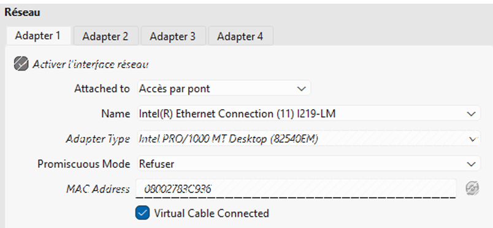
 

> [!NOTE]
> Le mode **Accès par pont** permet à la VM d'obtenir une IP sur le réseau local réel, comme une machine physique. Chaque VM aura ainsi une IP unique et différente.

---

## Mise à jour du système

### 1. Vérifier les paquets disponibles

```bash
sudo apt update
```


### 2. Appliquer les mises à jour

```bash
sudo apt upgrade
```

> [!NOTE]
> Linux peut indiquer qu'aucune mise à jour n'est requise mais signaler qu'un ancien paquet résiduel (ex. `libllvm8`) n'est plus nécessaire et peut être nettoyé.


***Le terminal en train de télécharger un paquet (linux-libc-dev) depuis internet*


---

## Configuration du serveur NFS

### 1. Installer le serveur NFS

```bash
sudo apt install nfs-server
```

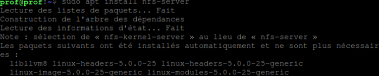

> [!NOTE]
> Le système sélectionne automatiquement `nfs-kernel-server` à la place de `nfs-server`.

### 2. Créer le dossier à partager

```bash
sudo mkdir -p /home/partage
```

### 3. Configurer les exports NFS

```bash
sudo nano /etc/exports
```

Ajouter la ligne suivante dans le fichier :

```
/home/partage IP_DE_LA_VM_CLIENTE(rw,no_root_squash)
```


> [!IMPORTANT]
> Remplacer `IP_DE_LA_VM_CLIENTE` par l'IP réelle de ta machine cliente (ex. `192.168.0.189`). Cette IP est celle obtenue via `ifconfig` sur la machine cliente.

**Pour quitter et enregistrer dans nano :**
1. `Ctrl + O` puis `Entrée` — sauvegarder
2. `Ctrl + X` — fermer l'éditeur

### 4. Démarrer le serveur NFS

```bash
sudo systemctl start nfs-server
```

### 5. Vérifier le statut

```bash
sudo systemctl status nfs-server
```


### Commandes utiles

| Commande | Effet |
|---|---|
| `sudo systemctl stop nfs-server` | Arrête le serveur, coupe l'accès aux partages |
| `sudo systemctl restart nfs-server` | Redémarre le serveur (à faire après modification de `/etc/exports`) |
| `sudo systemctl status nfs-server` | Vérifie que le service tourne |


---

## Configuration de la machine cliente

### 1. Récupérer l'IP de la machine cliente

```bash
ifconfig
```


### 2. Créer le point de montage

```bash
sudo mkdir -p /mnt/partage
```

### 3. Monter le partage NFS

```bash
sudo mount -t nfs IP_DU_SERVEUR:/home/partage /mnt/partage
```

> [!IMPORTANT]
> Remplacer `IP_DU_SERVEUR` par l'IP de la machine serveur (ex. `192.168.0.211`).


---

## Duplicati — Installation et configuration

### 1. Nettoyer le cache apt

```bash
sudo apt-get clean
```

### 2. Télécharger Duplicati (version 2.0.5.1)

```bash
wget https://updates.duplicati.com/beta/duplicati_2.0.5.1-1_all.deb
```

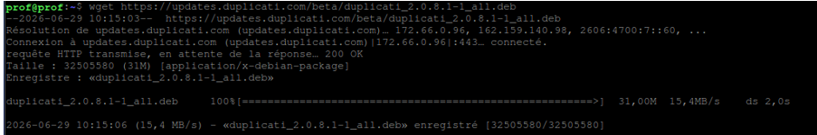

### 3. Installer le paquet

```bash
sudo apt install ./duplicati_2.0.5.1-1_all.deb -y
```

### 4. Réparer les dépendances si nécessaire

```bash
sudo apt install -f -y
```

### 5. Activer et démarrer le service

```bash
sudo systemctl enable duplicati
sudo systemctl start duplicati
```

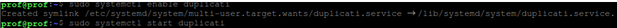

### 6. Accéder à l'interface web

Ouvrir Firefox et aller sur :

```
http://localhost:8200
```

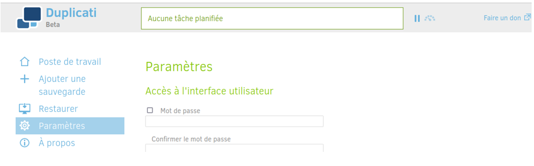

### 7. Configurer une sauvegarde

1. Cliquer sur **« Ajouter une sauvegarde »** (icône `+`)
2. Choisir **« Configurer une nouvelle sauvegarde »** → **Suivant**
3. Renseigner les **Paramètres généraux** :
   - **Nom** : `Sauvegarde_NFS`
   - **Chiffrement** : AES-256 (par défaut)
   - **Phrase secrète** : choisir un mot de passe

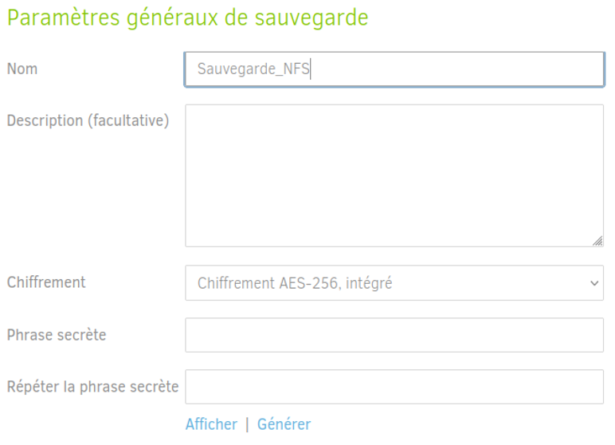

4. **Destination** — renseigner la destination :
   - **Type de stockage** : Dossier ou disque local
   - **Chemin du dossier** : `/mnt/partage`
   - Laisser **Nom d'utilisateur** et **Mot de passe** vides

> [!TIP]
> Cliquer sur **« Entrée manuelle du chemin »** (lien bleu au-dessus de l'arbre de dossiers) pour saisir `/mnt/partage` directement.

> [!NOTE]
> Les cases identifiants sont laissées vides car les permissions d'accès sont gérées directement par le protocole NFS.

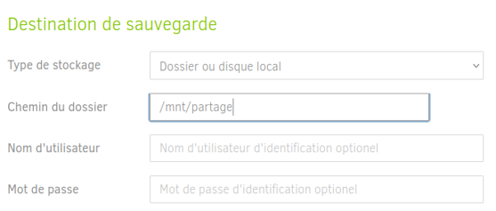

5. **Données source** — sélectionner les dossiers à sauvegarder :
   - ✅ `Desktop`
   - ✅ `Home` (pour test)

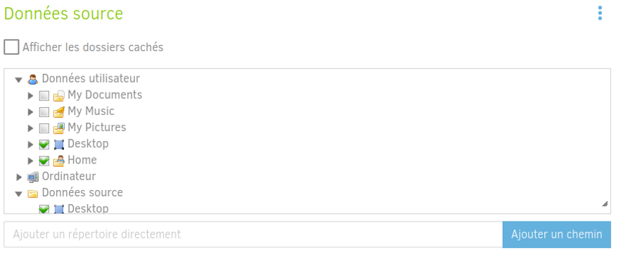

6. **Planification** — configurer la fréquence :
   - Cocher **« Lancer des sauvegardes automatiques »**
   - Fréquence : tous les **1 Jour**
   - Jours autorisés : tous cochés

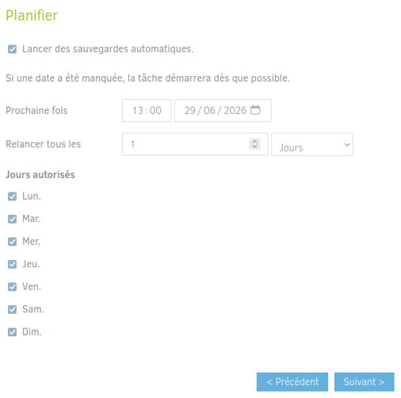

### 8. Lancer la sauvegarde manuellement

Cliquer sur **« Démarrer maintenant »** (ou *Run now*) sous le nom de la sauvegarde.


---

## Copie manuelle et archivage

### Vérification du contenu du partage

Côté serveur :

```bash
ls -lh /mnt/partage
```


Côté client (autre machine) :
Même liste visible depuis la machine cliente

```bash
ls -lh /mnt/partage
```

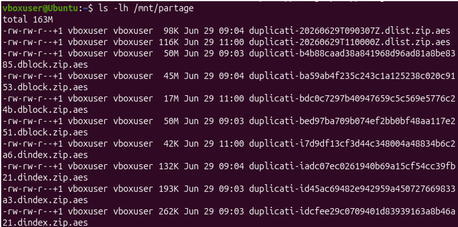

### Copie manuelle d'un fichier (cp)

```bash
cp /mnt/partage/duplicati-20260629T110000Z.dlist.zip.aes ~/Documents/
```

> [!NOTE]
> Cette commande copie un fichier `.aes` généré par Duplicati depuis le partage réseau vers le dossier `Documents` local du client.

### Archivage complet avec tar

```bash
tar -czvf ~/Documents/backup_duplicati_total.tar.gz /mnt/partage
```
*Pour créer une archive complète (un point de restauration figé) de tout notre dossier de sauvegarde NFS. On utilise tar pour compresser tout le contenu de /mnt/partage en un seul fichier**

> [!TIP]
> `tar -czvf` : **c**réer, **z** compresser (gzip), **v**erbeux (affiche les fichiers), **f** spécifie le nom du fichier de sortie.

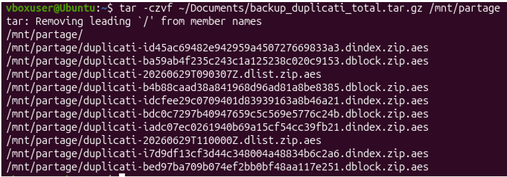

---

## Automatisation avec crontab

### Éditer le crontab

```bash
crontab -e
```

Aller tout en bas du fichier et ajouter la ligne :

```
0 0 * * * tar -czf /home/vboxuser/Documents/backup_duplicati_total.tar.gz /mnt/partage
```

> [!IMPORTANT]
> Format crontab : `minute heure jour_du_mois mois jour_de_la_semaine commande`
> Ici `0 0 * * *` = tous les jours à minuit.

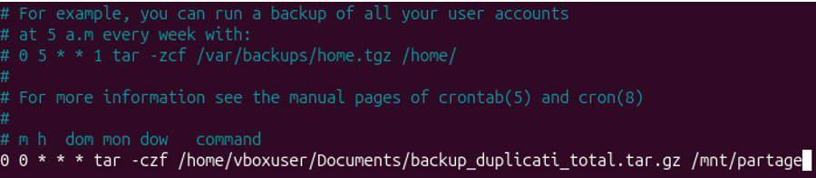

### Vérification après exécution

```bash
ls -lh ~/Documents/
```
***Une fois l'heure passée, ls -lh ~/Documents/  cette commande nous a permis de valider le bon fonctionnement de la tâche. On constate la création réussie de l'archive compressée de 163 Mo contenant l'ensemble des blocs Duplicati.*

> 

> [!NOTE]
> La présence du fichier archive confirme que la tâche crontab s'est exécutée correctement à l'heure programmée.
